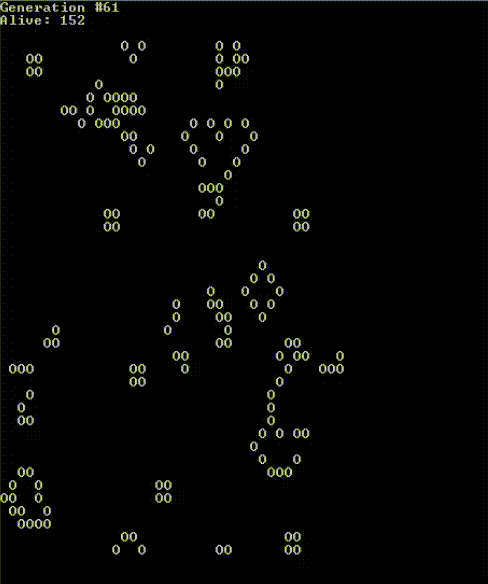

# Hyperskill Go - Game Of Life Project

- [Hyperskill Go - Game Of Life project](#hyperskill-go-game-of-life-project)
    - [About the project](#about-the-project)
        - [Status](#status)
        - [See also](#see-also)
    - [Getting started](#getting-started)

# Hyperskill Go - Game Of Life project

## About the project

This is the implementation of the Go Game Of Life project on Hyperskill.

### Status

The project is posted as it currently is, having passed the last step of the project ( 3 / 3 ).

### See also

* [Hyperskill - Game Of Life (Go)](https://hyperskill.org/projects/281)

## Getting started

Either
`go build main.go`
then `./main`

or
`go run main.go`

then just provide an integer number representing the size of the universe

